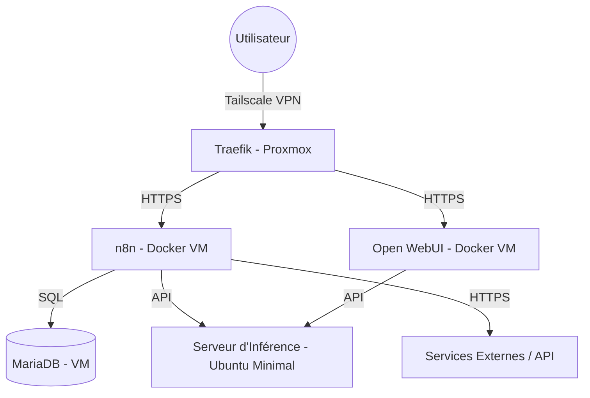
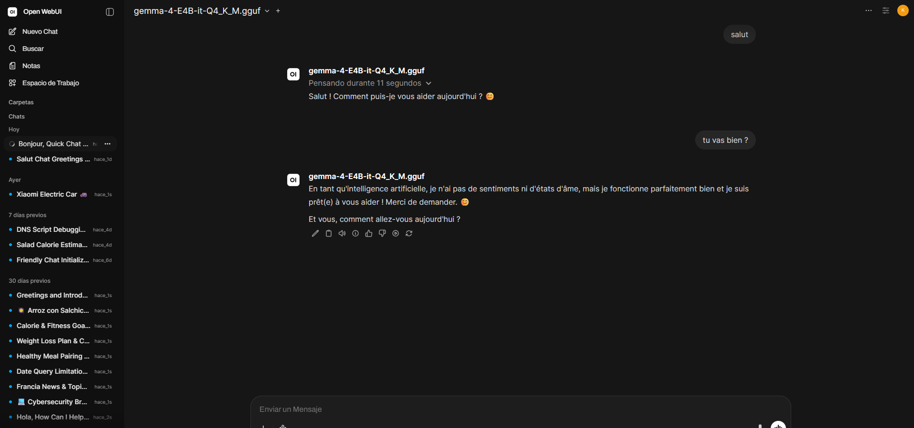
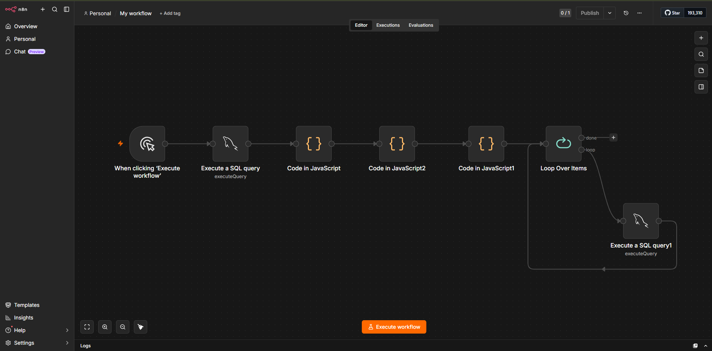

# Infrastructure d'Inférence IA et Automatisation de Flux

Ce projet fournit une architecture robuste pour déployer des modèles d'IA en local tout en orchestrant des flux de travail automatisés via n8n. Il centralise l'exécution de l'inférence, le stockage des données et l'automatisation des tâches complexes.

## 📋 Contexte

Ce projet est né du besoin d'automatiser la gestion de mes e-mails, bases de données et finances personnelles. Dans le contexte actuel et compte tenu de la sensibilité des données, j'ai opté pour une infrastructure entièrement auto-hébergée.

L'architecture est sécurisée par :

- **Chiffrement :** Toutes les communications (HTTPS) sont gérées par Traefik.
- **Accès Distant :** Utilisation de **Tailscale (VPN)**, évitant toute exposition de ports sur le routeur.

## 🎯 Objectif

- **Inférence Locale :** Déploiement optimisé de modèles LLM/Vision.
- **Modèles utilisés :** - **Gemma 2 4B (quantifié Q4) :** Choisi pour ses capacités multimodales.
  - **Qwen 2.5 7B :** Utilisé pour sa rapidité d'exécution et ses performances générales.
- **Automatisation :** Workflows intelligents via n8n.

## 🛠 Stack Technologique

### 🖥️ Couche Physique (Hardware)

- **Serveur d'Orchestration (Proxmox) :** Héberge les services de gestion et l'interface utilisateur.
- **Serveur d'Inférence (Ubuntu Minimal) :** Serveur dédié au calcul, équipé de **2x GPU NVIDIA (Architecture Pascal)** pour un total de **10 Go de VRAM**.

### 🧩 Couche Logicielle (Software)

- **Virtualisation :** Proxmox VE.
- **Conteneurisation :** Docker & Docker Compose.
- **Reverse Proxy :** Traefik (Gestion HTTPS/SSL).
- **Interface IA :** Open WebUI.
- **Orchestration de flux :** n8n.
- **Base de données :** MariaDB (VM dédiée).
- **Moteur d'inférence :** llama.cpp (optimisé pour le matériel Pascal).

## 🏗 Schéma d'architecture

## ⚙️ Choix Techniques & Optimisation

- **Séparation des responsabilités :** La séparation entre la VM Docker (n8n/WebUI) et le serveur d'inférence (Ubuntu/GPU) permet de ne pas surcharger les ressources de l'orchestrateur lors des pics de calcul.
- **Optimisation GPU :** L'usage de l'architecture Pascal avec `llama.cpp` permet de tirer parti des 10 Go de VRAM pour charger efficacement les poids des modèles Gemma et Qwen en local.
- **Sécurité :** L'absence d'exposition directe sur Internet, couplée à l'usage de Tailscale, réduit drastiquement la surface d'attaque.

---

## Examples

### Open Web UI

### N8n

